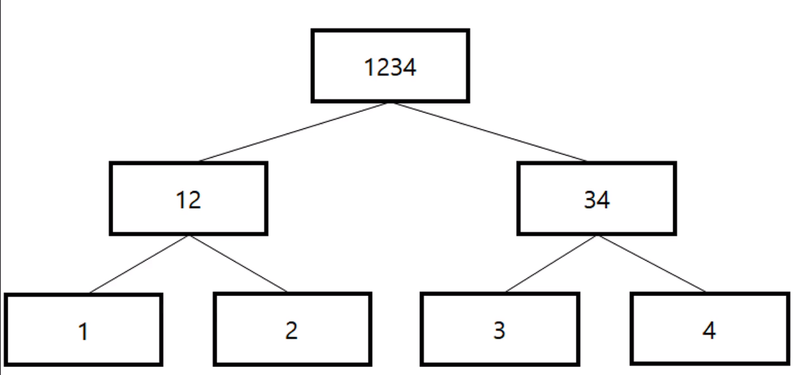

# BlockChain

- 과제 수행을 위한 기초 공부와 더불어 간단한 블록체인 튜토리얼

## Web 3.0

- Web 3.0은 인공지능에 기반한 맞춤형 정보를 제공하고 블록체인에 기반해 데이터 소유를 개인화하는 3세대 인터넷이다.

## 블록체인에서 말하는 탈중앙화

- 기존 웹서비스에서 데이터의 저장은 서비스를 제공하는 주체가 소유한 데이터베이스에 관계형 혹은 비관계형의 형태로 저장되었고 그 데이터의 보안은 인가된 사용자만 접근할 수 있도록 하는 폐쇄적인 환경을 가지고 있었다.

- 블록체인은 데이터 블록을 체인으로 연결하고 똑같은 블록체인을 모든 사용자의 컴퓨터에 복제하여 동일한 데이터를 가지도록 한다.

- 모두 동일한 데이터를 가지고 있기 때문에 변조를 하려면 다른 모든 사용자의 데이터 또한 변조시켜야 하므로 한 사람이 임의로 데이터를 변조할 수 없는 구조이다.

- 여기서 중앙 집중식 네트워크와의 차이점은 중앙 집중식의 경우 사용자는 서비스를 제공하는 주체에 대한 신뢰가 필요하지만 탈중앙화 네트워크의 경우 사용자는 다른 주체를 신뢰하지 않아도 되는 점이다.

- 예를 들어 화폐의 경우 은행과 정부라는 중앙 직권 기관이 존재하고 그 기관이 화폐의 가치를 결정한다.

- 블록체인 기반 가상화폐의 경우 가치를 결정하는 주체가 존재하지 않고 네트워크 내 참여자들에 의해 자유롭게 결정된다.

## 머클 트리와 노드

- 라이트 노드는 머클 트리의 루트 노드를 포함한 헤더만을 가지고 있는 노드를 의미하고 풀 노드는 머클 트리 전체를 가지고 있는 노드를 의미한다.

- 머클 루트는 블록이 보유하고 있는 거래 내역들의 해시값을 가장 가까운 거래내역끼리 쌍을 지어 해시화하고 쌍을 지을 수 없을 때까지 이 과정을 반복했을 때 얻게 되는 값이다.

- 이 머클 루트를 얻기 위해 반복하면서 생기는 트리가 머클 트리이다.

- 리프 노드는 하나의 트랜잭션(거래)에 대응되며 머클 트리를 통해 모든 트랜잭션을 관리할 수 있다.

- 

- 머클 트리의 리프 노드 하나만 변경하더라도 루트 노드의 값이 변경되기 때문에 루트 노드 값만 비교하더라도 검증이 가능하며 이로 인해 저사양 기기를 사용하더라도 블록체인에 참여할 수 있다.

## 블록체인의 가치 전달

- 은행 시스템을 통해 송금을 할 경우 데이터베이스에서 내 계좌의 돈을 마이너스 시키고 상대방의 계좌의 돈을 플러스 시키는 트랜잭션이 일어나고 이는 정보의 전달이다.

- 블록체인은 조작될 수 없는 데이터의 전달이므로 송금을 예로 들면 위와 같은 경우에도 그 데이터 자체가 가치를 가진다.

## 블록체인의 단점

- 가장 큰 단점은 트랜잭션 속도로 약 10번 이상 컨펌을 받아야 거래가 인정이 되고 초당 거래 횟수도 일반 신용 카드 결제의 1/100 정도이다.

- 블록의 수가 계속 증가하는데 모든 블록을 모두가 똑같이 저장해야 하므로 블록체인 노드의 용량이 계속 증가한다. 운영에서 어려움이 있다.

- 그리고 가스라는 트랜잭션이 일어날 때 사용자가 부담해야 하는 수수료가 있는데 가상 화폐의 가격이 오를 수록 가스도 증가하는 부담이 있다.

## 스테이킹(Staking)

- 가상 화폐를 블록체인에 예치하고 이에 대한 보상을 지급 받는 것으로 은행 예금과 같다(?).

## PoS

- PoS(지분증명, Proof of Stake)은 더 많은 지분(stake) 즉, 디지털 자산을 가지고 있을수록 그에 비례하여 블록에 기록할 권한을 더 많이 부여하는 증명 방식이다.

- 스테이킹을 할 때 지분이 더 많은 쪽이 더 많은 수익을 낼 수 있는 것이다.

## Block Finality

- 각각의 블록체인 노드들 사이에서 데이터 전송의 시간 차이가 발생한 경우 체인이 분기될 수 있다.

- 이럴 경우에는 길이가 긴 체인이 옳은 것으로 결정되고 길이가 짧은 체인은 폐기되면서 짧은 체인을 사용하는 노드에 기록된 거래 내역은 무효가 될 수 있다.

- 이런 현상을 방지하기 위해 이더리움은 거래 확정 후 25블록을 기다린 후 거래가 가능하도록 되어 있다고 한다.

## 솔리디티

- 솔리디티는 C++, Python, JavaScript의 영향을 받은 언어로 이더리움 버츄얼 머신(EVM)을 타겟으로 디자인되어 있다.

- 튜링완전한 언어로 반복문과 조건문을 사용할 수 있다.

- 동적 배열과 정적 배열을 모두 사용할 수 있다.

- 문자는 string과 bytes12 타입으로 선언할 수 있으며 string 타입이 UTF-8로 인코딩되어 표현된다.

- mapping은 키와 밸류 쌍으로 이루어진 자료형이다.

- 인터페이스를 사용해서 객체를 추상화할 수 있다.

- modifier는 함수에 같이 선언해서 함수가 실행되는 조건의 역할을 한다.

### 데이터 저장 위치

- 스토리지와 메모리가 있는데 스토리지는 블록체인에 영구 저장되는 데이터이고 메모리는 말 그대로 휘발성이 있는 저장 위치이다.

- 상태 변수와 같은 컨트랙트 최상단에 선언된 변수는 스토리지(블록체인)에 저장된다.

- 그 외 솔리디티에 내장된 전역 변수와 함수 내 지역 변수가 있는데 모두 기본 저장 위치는 스토리지이나 지역 변수는 memory 키워드를 사용해서 저장 위치를 메모리로 변경할 수 있다.

### 스마트 컨트랙트

- 클래스와 비슷한 객체로 상태 변수, 이벤트, 생성자, 함수, 함수 변경자(modifier)를 정의할 수 있다.

#### 가시성

- external, public, internal, private으로 컨트랙트에 접근할 수 있는 내용을 정의할 수 있다.

- external은 다른 컨트랙트나 트랜잭션을 통해서만 호출될 수 있으며 this를 사용해서

- public은 getter가 자동으로 생성되어 모든 방법으로 접근할 수 있다.

- internal은 내부적으로만 접근 가능하며 this를 사용할 수 없다.

- private은 internal과 비슷하지만 상속된 컨트랙트에서는 접근할 수 없다.

### 가스

- EVM에서 일련의 작업이 일어날 때 가스라는 것이 발생한다.

- 가상 화폐 거래의 수수료라고 볼 수 있다.

- 가스 리밋을 설정할 수 있다.

- 가스 프라이스는 가스당 가격을 의미하며 (가스 사용량 x 가스 프라이스)가 수수료가 된다.
